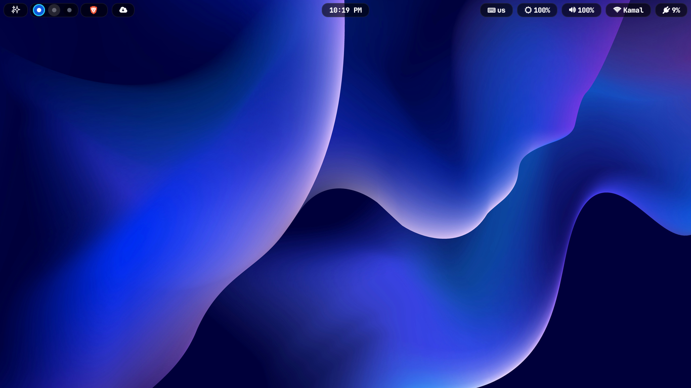
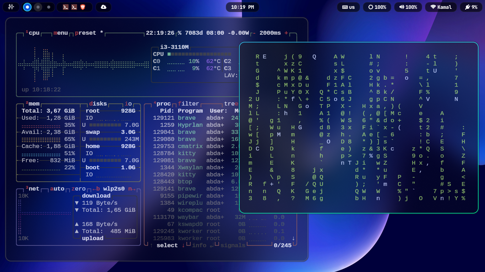
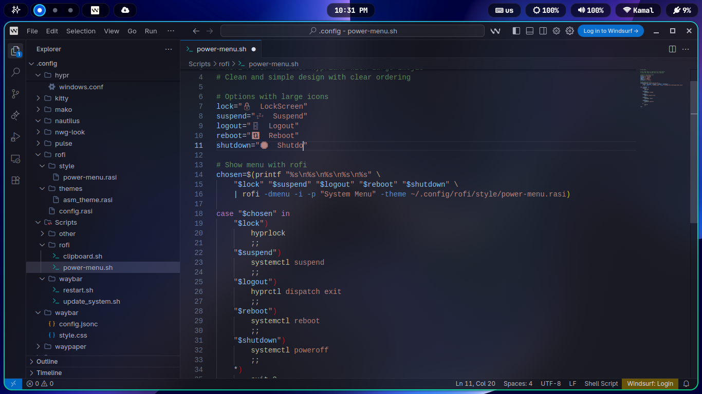
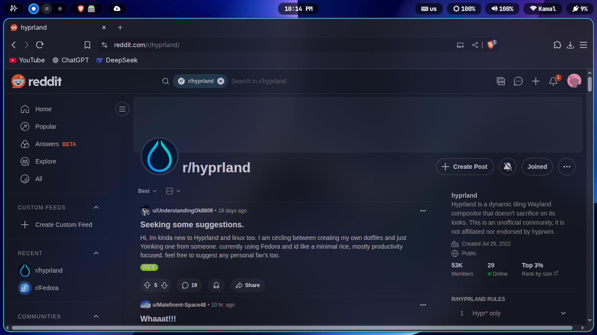

# Fedora Full Desktop Setup Guide
<p align="center">
  
  
</p>
<p align="center">
  
  
</p>


<!-- Comment: Table of Contents -->


## Table of Contents
- [System Setup](#system-setup)
- [Repositories](#repositories)
- [Core Components](#core-components)
- [System Tools](#system-tools)
- [Media](#media)
- [Applications](#applications)
- [Fonts](#fonts)
- [Appearance](#appearance)
- [Dotfiles](#dotfiles)
- [Firmware Update](#firmware-update)
- [Power Management](#power-management)
- [SDDM Setup](#sddm-setup)


---

## System Setup

Customize DNF Package Manager

```bash
sudo bash -c 'echo -e "\nmax_parallel_downloads=10\nfastestmirror=True\ninstall_weak_deps=False" >> /etc/dnf/dnf.conf'
```

---

## Repositories

```bash
# RPM Fusion
sudo dnf install https://download1.rpmfusion.org/free/fedora/rpmfusion-free-release-$(rpm -E %fedora).noarch.rpm
sudo dnf install https://download1.rpmfusion.org/nonfree/fedora/rpmfusion-nonfree-release-$(rpm -E %fedora).noarch.rpm

# COPR Hyprland
sudo dnf copr enable solopasha/hyprland

# Flatpak & Flathub
sudo dnf install flatpak
sudo flatpak remote-add --if-not-exists flathub https://flathub.org/repo/flathub.flatpakrepo

# Brave Browser Repo
sudo dnf install dnf-plugins-core
sudo dnf config-manager addrepo --from-repofile=https://brave-browser-rpm-release.s3.brave.com/brave-browser.repo

# Update System
sudo dnf --refresh upgrade
```

---

## Core Components

```bash
# Install Hyprland and dependencies
sudo dnf install hyprland hyprlock hypridle hyprland-qtutils hyprpicker hyprpolkitagent xdg-desktop-portal-hyprland waybar waypaper rofi-wayland mako libnotify grim slurp swww wl-clipboard xhost
```

---

## System Tools

```bash
# Install System Tools
sudo dnf install kitty git vim htop fastfetch cronie network-manager-applet blueman unrar p7zip p7zip-plugins gvfs gvfs-mtp jmtpfs
```

---

## Media

```bash
# Replace ffmpeg-free with ffmpeg-full
sudo dnf swap ffmpeg-free ffmpeg --allowerasing

# Install additional codecs
sudo dnf5 group install multimedia

sudo dnf install lame\* --exclude=lame-devel
# install application media
sudo dnf install vlc mpv gthumb imv playerctl pavucontrol
```
---

## Applications

```bash
# Install Applications
sudo dnf install chromium firefox brave-browser nautilus gedit copyq
```

---

## Fonts

```bash
# Install Fonts
sudo dnf install dejavu-sans-fonts fira-code-fonts fontawesome-fonts jetbrains-mono-fonts google-noto-cjk-fonts google-noto-emoji-fonts google-noto-fonts-common google-croscore-tinos-fonts google-croscore-cousine-fonts google-croscore-arimo-fonts google-noto-sans-arabic-fonts cascadia-code-nf-fonts fontawesome-6-brands-fonts fontawesome-6-free-fonts
 
# Activate Fonts
fc-cache -fv
sudo fc-cache -fv
```

---

## Appearance

```bash
# Install Appearance
sudo dnf install adw-gtk3-theme papirus-icon-theme kvantum qt5ct qt6ct nwg-look

# Install Vimix cursor
 git clone https://github.com/vinceliuice/Vimix-cursors.git && cd Vimix-cursors && sudo ./install.sh
```

---

## Dotfiles

```bash
# Copy Dotfiles
git clone https://github.com/Abdalsalamx/ASM-D.git
mkdir ~/.config/
cp -r ~/ASM-D/.config/* ~/.config/
cp ~/ASM-D/.bashrc ~/
cp ~/ASM-D/.vimrc ~/
sudo rm -rf ~/ASM-D

# Make executable scripts operable

 find ~/.config/Scripts/ -type f -name "*.sh" -exec chmod +x {} \;

```

---

## Firmware Update

```bash
# Update Firmware
sudo fwupdmgr get-devices
sudo fwupdmgr refresh --force
sudo fwupdmgr get-updates
sudo fwupdmgr update
```

---

## Power Management

```bash
# Install Power Management
sudo dnf install tlp tlp-rdw acpid brightnessctl udiskie udisks2
sudo systemctl enable tlp --now
sudo systemctl enable acpid --now
```

---

## SDDM Setup

```bash
# Install SDDM and dependencies
sudo dnf install sddm qt6-qtsvg qt6-qtvirtualkeyboard qt6-qtmultimedia
sudo systemctl enable sddm --force
sudo systemctl set-default graphical.target

# Apply Theme SDDM
 git clone -b main --depth=1 https://github.com/uiriansan/SilentSDDM && cd SilentSDDM && sudo ./install.sh

# Reboot System
reboot
```

---

